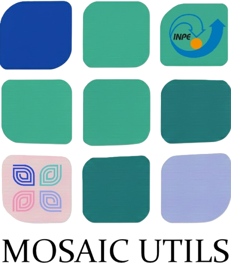
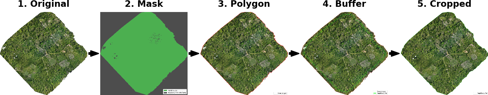

..
    This file is part of Python mosaic_utils tool.
    Copyright (C) 2026 HARMONIZE/INPE.

    This program is free software: you can redistribute it and/or modify
    it under the terms of the GNU General Public License as published by
    the Free Software Foundation, either version 3 of the License, or
    (at your option) any later version.

    This program is distributed in the hope that it will be useful,
    but WITHOUT ANY WARRANTY; without even the implied warranty of
    MERCHANTABILITY or FITNESS FOR A PARTICULAR PURPOSE. See the
    GNU General Public License for more details.

    You should have received a copy of the GNU General Public License
    along with this program. If not, see <https://www.gnu.org/licenses/gpl-3.0.html>.

.. image:: https://img.shields.io/badge/License-GPLv3-green
        :target: https://github.com/Harmonize-Brazil/mosaic_utils/blob/main/LICENSE
        :alt: Software License

.. image:: https://readthedocs.org/projects/mosaic-utils/badge/?version=latest
        :target: https://mosaic-utils.readthedocs.io/en/latest/
        :alt: Documentation Status

.. image:: https://img.shields.io/badge/lifecycle-experimental-orange.svg
        :target: https://www.tidyverse.org/lifecycle/#experimental
        :alt: Software Life Cycle

.. image:: https://img.shields.io/github/tag/Harmonize-Brazil/mosaic_utils.svg
        :target: https://github.com/Harmonize-Brazil/mosaic_utils/releases/latest
        :alt: Release

About
=====

**mosaic_utils** is a Python package providing utilities for processing
orthomosaics generated from drone imagery.

Its main tool, **crop-mosaic**, automatically removes invalid mosaic borders
while preserving all raster bands, georeferencing information and metadata.

Features
========

* Automatic removal of invalid mosaic borders.
* Supports RGB, multispectral and thermal mosaics.
* Automatic validity mask determination from:

  * Alpha band;
  * GDAL dataset mask;
  * User-defined pixel threshold.

* Outer polygon extraction from the validity mask.
* Inward (negative) buffer computation for robust cropping.
* Preservation of raster metadata, CRS and affine transform.
* Command-line interface suitable for batch processing.

Crop Mosaic Pipeline
====================

The ``crop-mosaic`` command automatically derives a cropping geometry
from the raster validity mask and removes invalid mosaic borders.

Quick Start
===========

Crop a mosaic using the default parameters:

.. code-block:: shell

    crop-mosaic \
        --mosaic_image mosaic.tif \
        --threshold_area 0.005

Display all available options:

.. code-block:: shell

    crop-mosaic --help

Documentation
=============

The complete documentation is available at:

`https://mosaic-utils.readthedocs.io/en/latest/ <https://mosaic-utils.readthedocs.io/en/latest/>`_

Additional documentation can be found in:

* ``docs/source/installation.rst`` — installation instructions.
* ``docs/source/usage.rst`` — command-line usage and examples.

License
=======

Copyright (C) 2026 INPE/HARMONIZE.