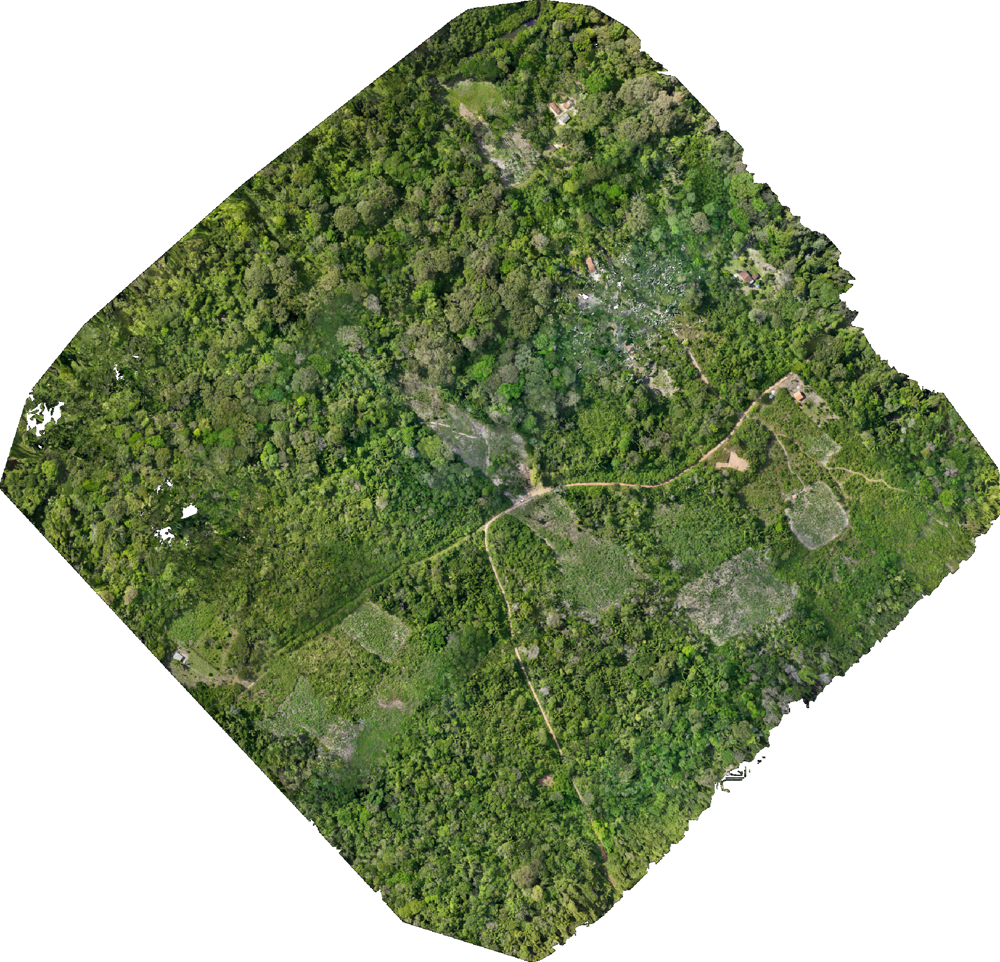
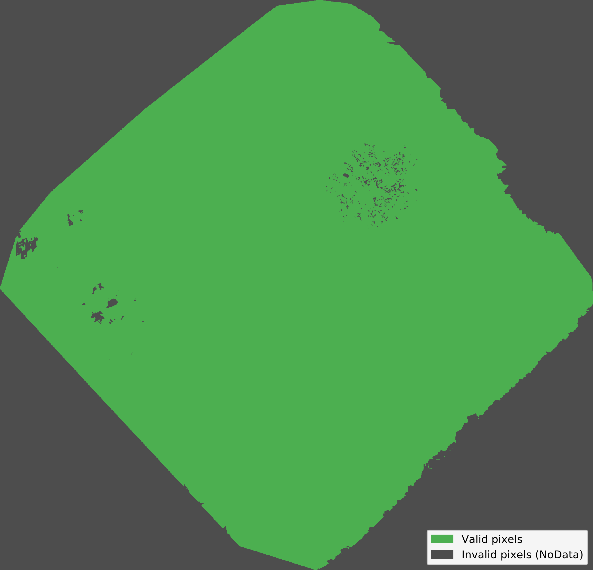
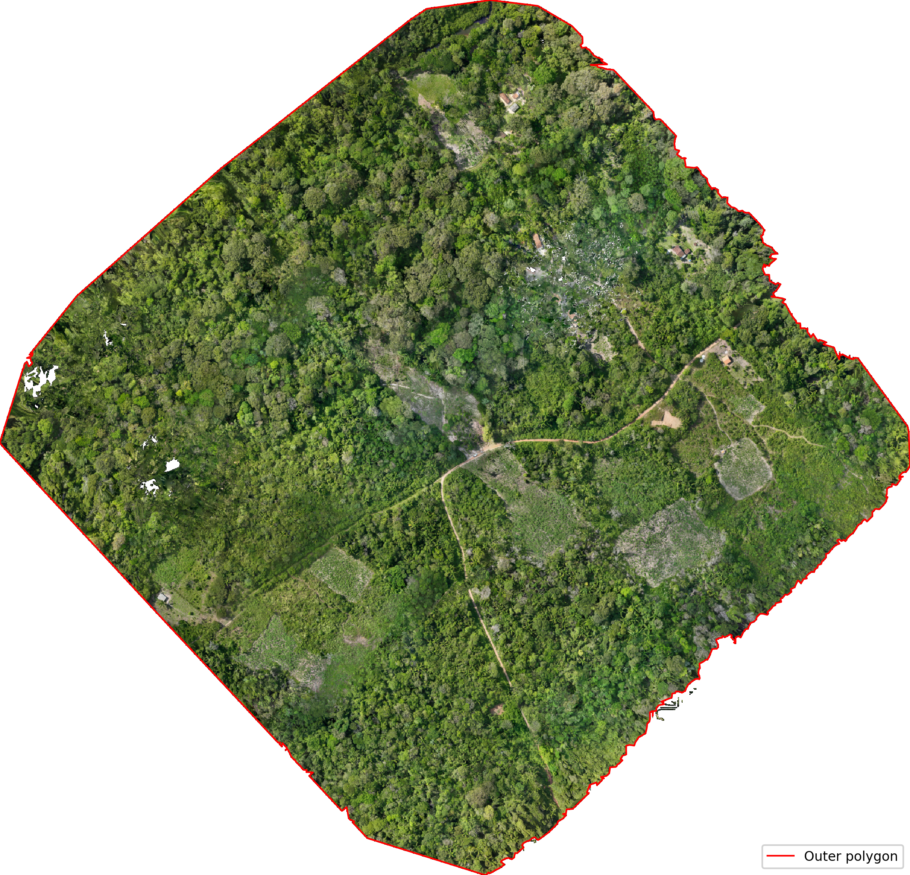
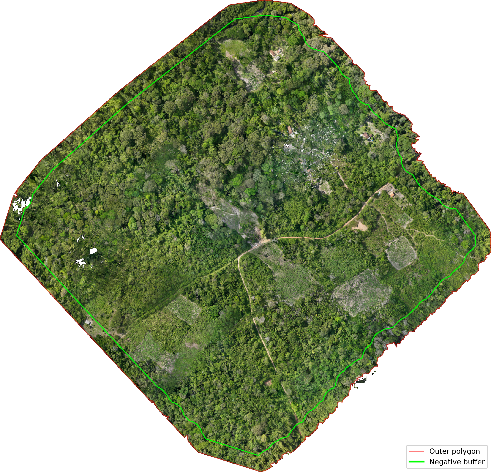
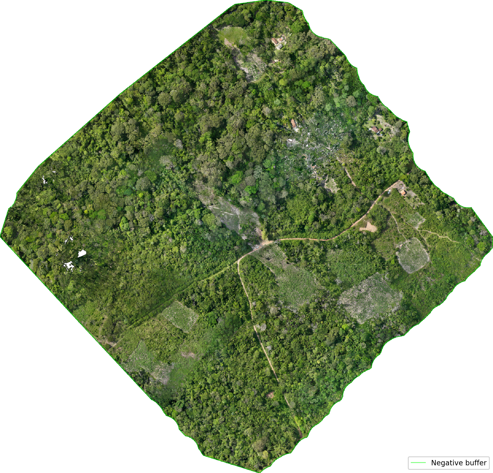

Crop Mosaic Algorithm
=====================

The ``crop-mosaic`` utility automatically removes border regions that 
are susceptible to reconstruction artifacts commonly found in orthomosaics 
generated by UAV photogrammetry.

Unlike traditional cropping approaches based on manually supplied
polygons, the algorithm derives the cropping geometry directly from the
raster validity mask, preserving the mapped area while removing invalid
border pixels.

Processing Pipeline
-------------------

The complete processing workflow is illustrated below:

.. image:: _static/crop_pipeline.png
   :alt: Crop Mosaic Processing Pipeline
   :width: 100%
   :align: center

The following sections describe each processing stage in detail.

Original Mosaic
~~~~~~~~~~~~~~~

The input raster may contain invalid pixels surrounding the mapped
region. These border artifacts are common in photogrammetric mosaics
and typically originate from poor image overlap or insufficient tie
points near the flight boundaries.

Validity Mask Determination
~~~~~~~~~~~~~~~~~~~~~~~~~~~

The first processing step consists of determining a binary validity
mask.

The algorithm automatically selects the first available source:

1. Alpha band.
2. GDAL dataset mask.
3. Automatic background detection (typically zero-valued pixels).
4. User-defined threshold.

When a threshold is supplied through ``--mask_threshold``, pixels whose
values are **greater than or equal to** the specified threshold are
considered valid.

This automatic strategy allows the utility to work with RGB,
multispectral and many thermal orthomosaics without requiring manual
configuration.

Outer Polygon Delimitation
~~~~~~~~~~~~~~~~~~~~~~~~~~

A small morphological erosion is applied to create a narrow artificial
border around the mosaic, ensuring that the outer contour is always
closed even when valid pixels touch the image boundaries.

The external contour is then extracted using OpenCV's contour tracing
algorithm, and converted into a georeferenced polygon.

Negative Buffer Computation
~~~~~~~~~~~~~~~~~~~~~~~~~~~

The extracted polygon is contracted using an inward (negative) buffer.

The buffer distance is computed from the value supplied by
``--threshold_area`` and is proportional to the mapped area.

This operation removes unstable border pixels while preserving the
overall geometry of the mapped region.

Cropped Mosaic
~~~~~~~~~~~~~~

Finally, the raster is cropped using the buffered polygon.

The output raster preserves:

* Coordinate Reference System (CRS);
* Affine transform;
* All raster bands;
* Band descriptions;
* Color interpretation;
* Compression settings;
* Other raster metadata.

Only pixels outside the buffered polygon are removed.

Algorithm Advantages
--------------------

Compared to previous implementations, the current algorithm offers
several advantages:

* Automatic validity mask detection.
* Supports RGB, multispectral and thermal orthomosaics.
* Robust contour extraction using OpenCV.
* Preserves concave boundaries.
* Memory-efficient windowed raster processing.
* Preserves raster metadata.
* Does not require manual polygon editing.
* Produces consistent results across different photogrammetry software.