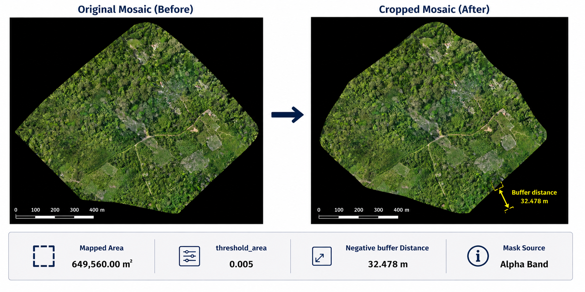
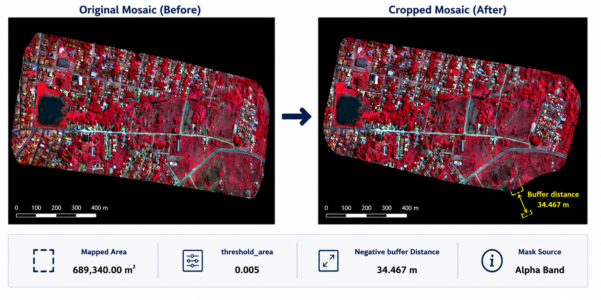
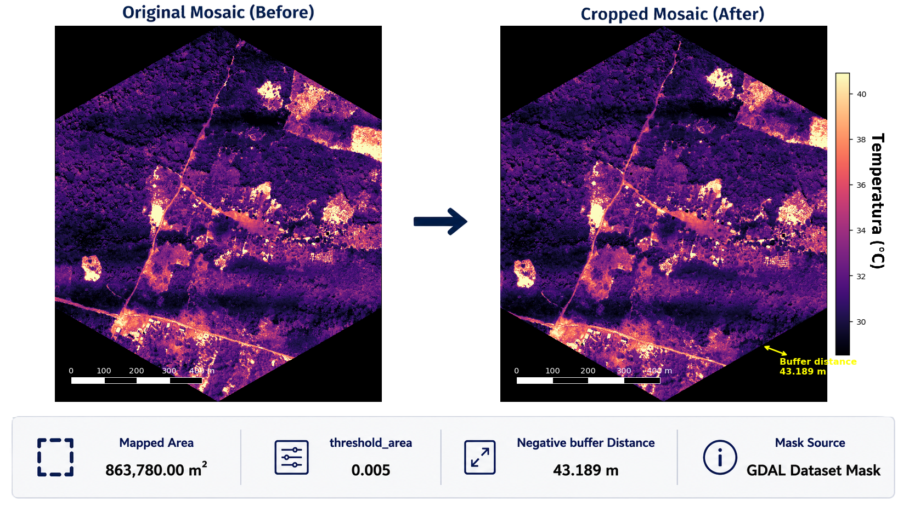

Examples
========

This section presents examples of ``crop-mosaic`` applied to RGB,
multispectral and thermal orthomosaics.

Depending on the input dataset, the validity mask may be obtained from
an Alpha band, a GDAL dataset mask, automatic background detection,
or a user-defined threshold.

The negative buffer distance is computed from the mapped area of the
input mosaic and the value specified by ``--threshold_area``.

For each example, the original and cropped mosaics are presented
side by side together with the mapped area, the selected
``--threshold_area`` and the resulting negative buffer distance.

In the examples presented here:

- the RGB orthomosaic derives its validity mask from the Alpha band;
- the multispectral orthomosaic also uses the Alpha band;
- the thermal orthomosaic uses a GDAL dataset mask.

RGB Orthomosaic
---------------

The following example shows the cropping of an RGB orthomosaic.

The original mosaic contains border regions that are susceptible to
reconstruction artifacts. The cropping algorithm extracts the outer
polygon from the validity mask, computes a negative buffer and produces
a cropped mosaic containing only the reliable mapped area.

Command
~~~~~~~

.. code-block:: shell

    crop-mosaic \
        --mosaic_image rgb_mosaic.tif \
        --threshold_area 0.005

Multispectral Orthomosaic
-------------------------

This example demonstrates the application of ``crop-mosaic`` to a
false-color multispectral orthomosaic (NIR–Green–Red composition).

The validity mask is automatically obtained from the Alpha band and
the same geometric workflow used for RGB mosaics is applied.

Command
~~~~~~~

.. code-block:: shell

    crop-mosaic \
        --mosaic_image multispectral_mosaic.tif \
        --threshold_area 0.005

Thermal Orthomosaic
-------------------

Thermal orthomosaics may represent invalid pixels differently from RGB
or multispectral mosaics. Depending on the dataset, the validity mask
may be obtained from a GDAL dataset mask, automatic background
detection or a user-defined threshold.

.. note::

   Original thermal mosaic courtesy of Innovalab,
   Universidad Peruana Cayetano Heredia.

   https://www.innovalab.info/harmonize

Command
~~~~~~~

.. code-block:: shell

    crop-mosaic \
        --mosaic_image thermal_mosaic.tif \
        --threshold_area 0.005

Understanding the Buffer Distance
---------------------------------

The ``--threshold_area`` parameter controls the amount of mapped area
removed before generating the final cropped mosaic.

Rather than specifying a fixed distance, the parameter represents a
fraction of the mapped area. This fraction is converted internally
into the negative buffer distance applied to the outer polygon.

Consequently, the same ``--threshold_area`` value may produce different
buffer distances for mosaics covering different mapped areas.

For example,

.. code-block:: shell

    --threshold_area 0.005

may result in different negative buffer distances when applied to
mosaics with different mapped areas.

For this reason, each example reports both the mapped area and the
corresponding negative buffer distance.

Comparison
----------

These examples demonstrate that the same cropping workflow can be
applied to RGB, multispectral and thermal orthomosaics.

The primary difference between datasets lies in how the validity mask
is determined. Once the validity mask has been obtained, the remaining
processing steps—outer polygon extraction, negative buffer computation
and raster cropping—are identical regardless of the sensor type.